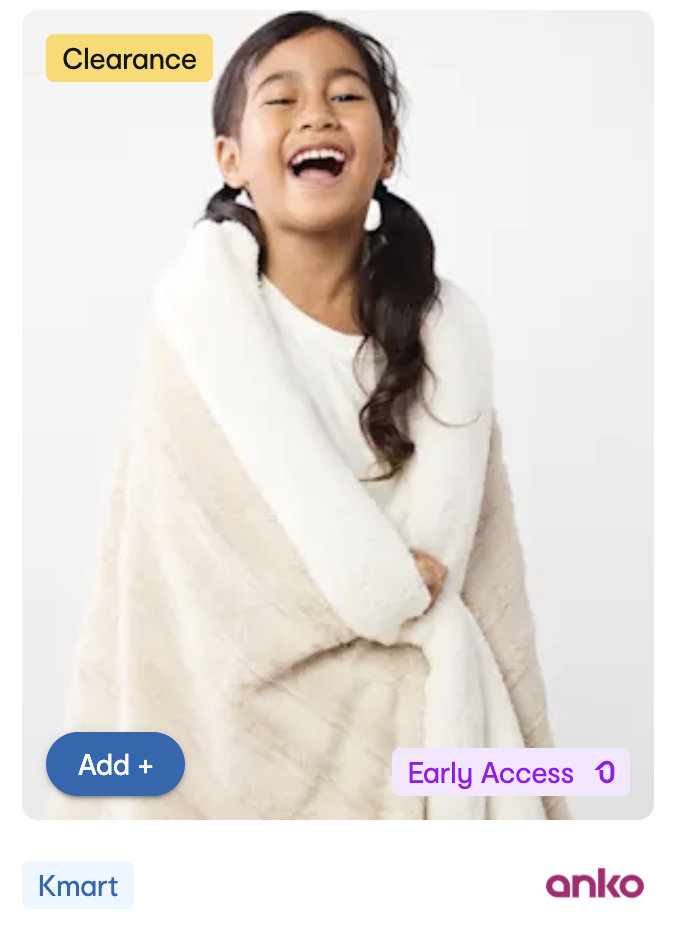

# Kosmos DS - Pairing Interview Session

## Prerequisites
- install `pnpm` v9.12.0
- install `node` v20.18.0

## 🎯 Task: Build a “Badge” Component

Your task is to build a reusable Badge component in our DS.

Build clean, atomic components using React, HTML, and CSS.

It should:

•	Display a badge label (e.g., “On Sale”, “Exclusive”, “Limited Edition”).

•	Support optional icon/logo on the left.

•	Accept a color variant prop (e.g., “primary”, “warning”, “success”, “neutral”).

•	Allow size variation (e.g., small, regular, large).

•	Should follow atomic design (create atoms/molecules accordingly).

•	Use accessible markup (ARIA where needed).

•	Must render well on mobile + desktop. 
  - on mobile the font needs to be 12px and on desktop 14px)
  - the spacing is up to you as a designer to make it look nice!!

•	Come up with a nice design. Here are some examples

Think of it like a simplified version of how a badge in Kmart’s site might call out campaign types.

---

## Requirements

•	Use Box, Typography, and existing primitives leverage MUI.

•	Use styled components or MUI styled() API if custom styles are needed.

•	Place your component inside /components/ui/data-display/badge.

•	Create a Storybook story under data-display/Badge.

---

## Bonus (we’ll pair on this during the session)

If you finish early or feel like going the extra mile, you can:
•	Add animation or hover effects (e.g., pulse for “Hot Deal”).
•	Add support for tooltips or long-label truncation with ellipsis.
•	Show how this could be extended to support Badging Engine Rules (e.g., pass rules config to render different badge combos).

---

## What we’re evaluating

•	Component structure and naming

•	Atomic design awareness

•	Responsiveness

•	Accessibility

•	CSS practices (using tokens, spacing, consistent styles)

•	Storybook presentation (is it dev-friendly and clear?)

---

### To Run

pnpm install
pnpm storybook

Visit http://localhost:6006

There is a example Box component to get you started!

Good luck!!

---

### On Pairing Day

We’ll do a short session where you might:

•	Refactor the component

•	Integrate with a token system

•	Discuss how to scale this for other badge types (e.g., Seller Badge, Callout Badge)

•	Add some states (loading, disabled, etc.)

